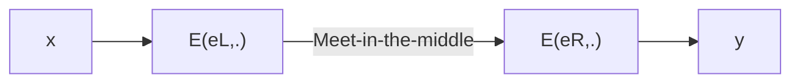

# 🔐 Foundations of Cybersecurity

The student will acquire knowledge about applied cryptography, secure coding, and web security. The objective of the course is to make a student able to properly design and implement a secure distributed application.

More precisely, the student will get a detailed knowledge of the main cryptographic primitives (ciphers, hash functions, digital signatures), their properties in terms of security and performance, and their appropriate usage in designing and building protocols and systems. The student will also get basic notions about secure coding, web security, and the related main attacks including buffer overflow and SQL injection.

# 📝 Exam Practice 
Course Foundations of Cybersecurity with Professor Dini

## 📚 Theory

### Exercise n.1

State and prove Shannon’s Theorem.

<details><summary>Solution</summary>
<p>

In a perfect cipher $\left | K \right | \geq \left | P \right |$; it means the number of keys cannot be smaller than the number of messages.

*Proof*. To prove it by contradiction try and assume that the statement is false, proceed from there, and at some point, you will arrive at a contradiction:
- Let's assume $\left | K \right | < \left | P \right |$
- For the invertibility, it is reasonable to have $\left | C \right | \geq \left | P \right |$; because if $\left | C \right | < \left | P \right |$ there are at least two plaintexts for a ciphertext, so we cannot derive the plaintext for a given ciphertext (not invertible).
- From the previous relations we have $\left | C \right | > \left | K \right |$. If we encrypt a plaintext $p_0 \epsilon P$ with all possible keys $k_i$, there is at least a ciphertext $c_0 \epsilon C$ that is not the preimage of $p_0$.
- Then, we have $P(P=p_0) \neq 0$ and $P(P = p_o | C = c_0) = 0$. We found a case in which the definition of Shannon is not verified, so we found a contradiction.

Perfect Secrecy means unconditional security, because we assume that an adversary has infinite computing resources and observation of the ciphertext provides the adversary with any information. A necessary condition for perfect secrecy is that the key bits are truly randomly chosen (we might be able to decrypt if is not perfectly random) and the key length is at least as long as the message length.

</p> 
</details>

### Exercise n.2

Explain the RSA key generation algorithm, discussing the complexity of each step.

<details><summary>Solution</summary>
<p>
The key generation algorithm. The RSA key generation algorithm is:
  
1. Choose two large distinct primes $p,q$
2. Compute the modulus $n = p \times q$
3. Compute the Euler's Phi function $\phi(n) = (p-1) \times (q-1). \phi(n)$ returns the number of integers in $\mathbb{Z}_n$ coprime with n.
4. Randomly select the public (encryption) exponent $e: 1 < e < \phi (n)$ , s.t $gcd(e, \phi(n) ) = 1$ (e is coprime with $\phi (n)$ ).
5. Compute the unique private (decryption) exponent $d: 1 < d < \phi$, s.t $e \cdot d \equiv 1 mod( \phi )$. This equivalence contains one unknown (d). We can compute d from the equation $e \cdot d \equiv 1 + t \phi $. For a certain value of t (it denotes a multiple of $\phi$, we are not interested in a particular value). We are able to solve this equation because e is coprime with $\phi (n)$ and the solution is $d = e^{-1} mod( \phi )$.
7. Private $key = (d,n)$
8. Public $key = (e,n)$

Primes p and q are $100 \div 200$ decimal digits, nowadays are around 1024 bit. Condition $gcd(e,\phi(n))=1$ guarantees that d exists and is unique. At the end of key generation, p and q must be deleted. If an adversary finds them it is able to compute d, e, and n. Two parts of the algorithm are not trivial; step 1, because is very demanding (large prime numbers), steps 4-5 (Step 5 are crucial for RSA correctness). 

</p>
</details>

### Exercise n.3

Describe the meet-in-the-middle attack on 2DES and argue about its complexity.



<details><summary>Solution</summary>
<p>
  
Two times encryption 2DES. We encrypt the plaintext twice, considering the case in which the algorithm is used twice: $y = 2E((e_L,e_R), x) = E(e_R, E(e_L,x))$, where x is a plaintext y is the ciphertext and $(e_L,e_R)$ are the left and the right key respectively. The key size is 2k bits (double), so a brute force attack requires $2^{2k}$ steps. 2E has performance penalties. It is two times slower than DES because it encrypts the message twice. It seems that we have significant security improvement, but this is not true. In fact, a meet-in-the-middle attack is possible.

A meet-in-the-middle attack is a known-plaintext attack, the adversary must know at least one plaintext/ciphertext pair. The attack is performed as follows:
- Build a table T containing $z=E(e_L, x)$ for all possible left-keys. Keep T sorted according to z.
- Check whether $z'=D(eR, y)$ is contained in the table T, for all possible right-keys. If z' is contained in T then $(e_L, e_R)$ maps x into y with $e_L$, s.t $T[e_L] = z'$ (Meet-in-the-middle)

Attack complexity:
* **Data Complexity**: Negligible. It needs at least a pair of data. There might be false positives. For simplicity, we assume the probability of false positives negligible. anyway, to get rid of them we may need two or more plaintext/ciphertext pairs.
* **Storage Complexity**: Storage necessary for $T \approx O(2^k)$. The table has many entries as the number of keys, it grows exponentially with the size of the key.
* **Time Complexity**: Time complexity for 1 + time complexity for step 2 = time for building and sorting the table + time for searching in a sorted table = $k2^k + k2^2 \approx O(2^k)$

Double encryption is not more secure than single encryption. The time complexity is the same as the brute force attack of single encryption. The comparison is unfair because the meet-in-the-middle attack requires much storage, but it is still not better in terms of time complexity. 2DES has time complexity $(2^56)$ and space complexity $(2^56)$. It brings no advantages.

</p>
</details>


### Exercise n.4

<details><summary>Solution</summary>
<p>
  
</p>
</details>

### Exercise n.5

1. Illustrate the authenticated encryption (AE) scheme *encrypt and authenticate*.
2. Argue whether it can be considered secure.
3. Illustrate the AE scheme “encrypt then authenticate”.

<details><summary>Solution</summary>
<p>
  
</p>
</details>


### Exercise n.6


With reference to one-time pad (OTP), answer the following questions.

1. Illustrate the key generation, encryption, and decryption algorithm.
2. Given $k_{0} = 0^n$, then $c = p ⊕ k_{0} = p^1$. Argue whether removing k0 from the key set is a good idea or not.
3. Let c = "HELLO". Specify which of the following strings could constitute possible corresponding plaintexts and which cannot be.
    1. "HELLO"
    2. "LIGHT"
    3. "BLUE"
    4. "YELLOW"

<details><summary>Solution</summary>
<p>
  
</p>
</details>

### Exercise n.7

1. Illustrate and discuss the minimum set of information items you expect to find in a certificate.
2. Explain the difference between an invalid and a revoked certificate.
3. For each of the following certificate templates, indicate whether it is secure or not. Motivate your answers.
  1. $\left \langle A, \Pi_A, L_A  \right \rangle _A$
  2. $\left \langle A, \Pi_A, L_A  \right \rangle _CA$
  3. $\left \langle A, \Pi_A, L_A  \right \rangle _B , \left \langle B, \Pi_B, L_B  \right \rangle _B$
  4. $\left \langle A, \Pi_A, L_A  \right \rangle _B , \left \langle B, \Pi_B, L_B , ca=yes \right \rangle _{CA}$

Where $S_P(X)$ denotes the digital signature of principal $P$ on statement $X; \left \langle X  \right \rangle _P$ denotes ${X, S_P(X)}; \Pi_P$ denotes principal $P$’s public key, $L_P$ denotes the validity interval of $\Pi_P$ and finally, $CA$ denotes a trusted certification authority.

<details><summary>Solution</summary>
<p>
  
</p>
</details>

### Exercise n.8

With reference to the Diffie-Hellmann key establishment protocol
1. Describe the protocol;
2. Argue about the security of the protocol w.r.t. to a passive adversary;
3. Argue about the security of the protocol w.r.t. to an active adversary;
4. Discuss a possible solution to the MIM attack


<details><summary>Solution</summary>
<p>
  
</p>
</details>

### Exercise n.9 

1) Describe the key generation algorithm of the RSA encryption scheme.
2) Discuss the complexity of each algorithm step.

<details><summary>Solution</summary>
<p>
  
</p>
</details>

## 📊 Analysis

### Exercise n.1

The hash function H(·) suffers from collision attacks in $2^{41}$, exploiting the inner structure function and simply appending properly crafted blocks to the message. Besides this, the size of H(·), 128 bits, limits its maximum collision resistance to $2^{64}$.

Willing to strengthen the H(·), three proposals are made:
* a) H-A(m) is defined as SHA2-256(H(m))
* b) H-B(m) is defined as H(SHA2-256(m))
* c) H-C(m) is defined as AESk(H(m)), with a fixed key k
* d) H-D(m) is defined as SHA2-256(H(SHA2−256(m)))


Comment on the improvements to the collision resistance of the resulting hash function. 

<details><summary>Solution</summary>
<p>

Let's analyze each proposal and comment on the improvements to the collision resistance of the resulting hash function:

**a) H-A(m) is defined as SHA2-256(H(m)):**
In this proposal, the hash function H(m) is applied first, followed by SHA2-256. Since SHA2-256 is a widely-used and well-analyzed hash function, it is believed to have a strong collision resistance property. By applying SHA2-256 to the output of H(m), it adds an extra layer of security against collision attacks on the inner structure of H(·). This additional step strengthens the collision resistance of the resulting hash function.

**b) H-B(m) is defined as H(SHA2-256(m)):**
Here, the order of applying the hash functions is reversed compared to the proposal (a). SHA2-256 is applied to the message m first, and then the result is passed through the hash function H(·). Since the inner structure of H(·) was vulnerable to collision attacks, applying SHA2-256 to the message before using H(·) can provide some resistance against these attacks. However, the overall improvement in collision resistance may not be as strong as in proposal (a) because the vulnerable inner structure of H(·) is still present.

**c) H-C(m) is defined as AESk(H(m)), with a fixed key k:**
In this proposal, the output of H(m) is encrypted using the AES (Advanced Encryption Standard) algorithm with a fixed key k. AES is a symmetric encryption algorithm widely used and considered secure. By applying AES encryption to the output of H(m), introduces an additional layer of complexity and makes it harder for an attacker to find collisions. However, it's important to note that the collision resistance of this proposal relies on the security of AES and the secrecy of the fixed key k.

**d) H-D(m) is defined as SHA2-256(H(SHA2−256(m))):**
This proposal combines the ideas from both proposal (a) and proposal (b). The message m is first passed through SHA2-256, then H(·) is applied, and finally, the resulting hash is passed through SHA2-256 again. By applying SHA2-256 twice, it adds an additional layer of security against collision attacks on the inner structure of H(·). This approach is similar to the proposal (a) but with an extra step of applying SHA2-256 to the final hash. As a result, it further strengthens the collision resistance compared to the original H(·) hash function.

In summary, among the given proposals, (a) and (d) offer the most significant improvements to the collision resistance of the resulting hash function. Proposal (a) applies SHA2-256 to the output of H(m), while proposal (d) applies SHA2-256 twice to the final hash. Both of these approaches add extra layers of security and are likely to enhance collision resistance. Proposal (b) provides some improvement but may not be as strong as (a) and (d) due to the vulnerable inner structure of H(·). Proposal (c) relies on AES encryption, which can provide additional complexity but its collision resistance depends on the security of AES and the secrecy of the fixed key.

</p>
</details>

### Exercise n.2

Alice wishes to protect passwords from an attacker who manages to grab the password file and then perform an offline attack, possibly based on a rainbow table attack. For this reason, Alices decides to salt the hashing. Let p denote a plaintext password and s a 128-bit random salt. 

Alice adopts the following salting scheme: **Scheme 1:** Compute $h = MD5^{1000}(p) ⊕ s$, and store the pair (h, s) in the password file.
* A. Discuss the security of this scheme w.r.t. a rainbow table attack.

Bob suggests Alice employ the following salting scheme: **Scheme 2:** Compute $h = MD5^{1000}(p || s)$, and store (h, s) in the password file.
* B. Is this choice better or worse than Alice’s w.r.t. a rainbow table attack?

Within Scheme 2, assume that users employ 8 characters chosen over the English lowercase alphanumeric characters.
* C. How many bits long should be the salt to prevent an attacker able to compute $2^{70}$ passwords from employing a rainbow table attack?
* D. Does the previous amount of random salt prevent an attacker from brute forcing a single password?

<details><summary>Solution</summary>
<p>
  
</p>
</details>

### Exercise n.3

A client C and server S share a password P. Furthermore, C knows the public key s of the server S. Client’s and server’s clocks are not synchronized. Design a protocol that makes it possible to establish a symmetric session key kcs between the client and the server. The protocol must avoid both the replay attack and the offline password-guessing attack. Furthermore, it must satisfy the key authentication and key confirmation properties.

<details><summary>Solution</summary>
<p>
  
</p>
</details>

### Exercise n.4

Let m be a 256-bit message and mi denote the i-th. Consider the following one-time digital signature scheme.
* Key generation algorithm.
  1. Generate two random sequences $S^0$ and $S^1$, both of 256 elements, defined as follows: $𝑆^𝑘 = {𝑆_{𝑖}^𝑘 , 1 ≤ 𝑖 ≤ 256}, 0 ≤ 𝑘 ≤ 1, s.t., 𝑆_{𝑖}^𝑘 ← random()|_{256}$. Let $S = {S^0, S^1}$ be the private key.
  2. Generate two sequences $P^0$ and $P^1$, defined as follows $𝑃^𝑘 = {𝑃_{𝑖}^𝑘 , 1 ≤ 𝑖 ≤ 256}, 0 ≤ 𝑘 ≤ 1, s.t., 𝑃𝑖𝑘 ← 𝐻(𝑆_{𝑖}^𝑘)$, where H() is a 256-bit one-way hash function. Let $P = {P^0, P^1}$ be the public key.

* Signature generation algorithm. The digital signature $D$ of $m$ is defined as follows:

$$
\forall 1 \leq  i \leq  256, D{i} = 
\begin{Bmatrix}
 S_{i}^0 & \text{if } m_{i} = 0 \\
 S_{i}^1 & \text{if } m_{i} = 1 
\end{Bmatrix}
$$

Answer the following questions.
1. Determine the size in a bit of the digital signature.
2. Specify the signature verification algorithm.
3. Argue about the unforgeability of the signature scheme.
4. Assume the secret key is used to digitally sign two different messages x and y. Let X and Y be their respective digital signatures. Describe a possible existential forgery attack that generates a valid pair (z, Z).

<details><summary>Solution</summary>
<p>
  
</p>
</details>

### Exercise n.5
Assume a threat model in which an adversary can steal the password file and perform an off-line Rainbow Table attack.
* Assume we adopt the following salted hashing technique: $h = H^{1000}(p) ⊕ s$ where $p$ is the plaintext password, $s$ is a 128-bit random salt, and $H$ is a secure one-way has function. The pair $(h, s)$ is stored in the password file on disk. Is this approach secure? Explain why.
* Assume now we adopt the following salted hashing technique: $h = H(p||s)$ and again, we store the pair $(h, s)$ in the password file on disk. Is this choice better than the previous one? Explain why.
* With reference to the second hashing scheme, if users employ 8 characters passwords chosen over the lowercase alphanumeric characters, how many bits long should be the salt to prevent an attacker able to (pre-)compute 270 passwords from employing a Rainbow Table attack?
* Does the previous amount of random salt prevent an attacker from brute-forcing a single password?


<details><summary>Solution</summary>
<p>
  
</p>
</details>

### Exercise n.6

Let us consider the DES cipher in the CBC mode of operation. Assuming we encrypt a very large amount of data with the same key, it is possible that two different ciphertext blocks, say $c_i$ and $c_j$,
with $i \neq j$, are the same.

1. Does the fact that $c_i = c_j$ leak any information regarding the plaintext blocks $m_i$ and $m_j$?
2. Does replacing DES with 3DES avoid information leakage?
3. How can we mitigate this attack?


<details><summary>Solution</summary>
<p>
  
</p>
</details>

### Exercise n.7

Assume that a file (possibly the whole volume) is stored in its encrypted form under AES-128-CBC. The file can be randomly accessed on a per-block basis.

1. Show that it is possible to apply a controlled modification to a given location of the plaintext file while operating on the encrypted version (malleability attack).
2. Argue the price the adversary must pay for this attack.
3. Assume that we insert a parity bit in each file block. Is this control able to mitigate or prevent the malleability attack?

<details><summary>Solution</summary>
<p>
  
</p>
</details>

### Exercise n.8 

Alice and Bob use the Diffie-Hellman protocol to establish a session key. Let $Y_A$ and $Y_B$ be their respective public parameters. In order to prevent a man-in-the-middle attack, Alice and Bob maintain a trusting relationship with a trusted third party named Trent, who acts as a certification authority. These trust relationships are realized through the keys $K_a$ and $K_b$, which Alice and Bob, respectively, share with the authority in advance.

Assuming that the clocks of Alice, Bob, and Trent are not synchronized, design a protocol for the certification of the public parameters that allows achieving the following beliefs: $A \mid \equiv  \mapsto B$ and $B \mid \equiv  \mapsto A$

## 💻 Secure Coding

### Exercise n.1

Find and explain the vulnerabilities of the following function. Then patch them.
````c++
void ExpandVector(std::vector<int>& c) {
  // This code wants to expand the vector c by doubling each of its
  // elements. For example, the vector [1,2,3] must become
  // [1,1,2,2,3,3].
  auto i = c.begin();
  while (i != c.end()) {
    c.insert(i, *i);
    i++;
  }
}
````

<details><summary>Solution</summary>
<p>

The given function, ExpandVector, intends to double each element in a vector by inserting a copy of each element before the original element. However, it suffers from two vulnerabilities: an infinite loop and an iterator invalidation issue. Let's discuss these vulnerabilities and propose patches for each:

**Infinite Loop:**
The function uses an iterator, 'i,' to traverse the vector and double each element. However, it fails to update the iterator 'i' after inserting the copy of the element. As a result, the iterator remains pointing to the original element, causing an infinite loop where the same element is repeatedly inserted before itself.
Patch for the Infinite Loop vulnerability:
To fix this issue, the iterator 'i' should be updated to point to the next position after inserting the copy of the element. This can be achieved by using the return value of the insert function, which provides an iterator pointing to the newly inserted element. Here's the modified code:

````c++
void ExpandVector(std::vector<int>& c) {
  auto i = c.begin();
  while (i != c.end()) {
    i = c.insert(i, *i);
    i += 2;
  }
}
````

By incrementing **i** by 2 after inserting the copy of the element, we ensure that the iterator moves to the correct position for the next iteration.

**Iterator Invalidation:**
The insert operation in the original code may invalidate the iterator 'i,' leading to undefined behavior. When an element is inserted before the current position, all existing iterators may become invalid. In our case, the iterator 'i' can be invalidated after each insert operation.
Patch for the Iterator Invalidation vulnerability:
To handle iterator invalidation, we can modify the code to use the result of the insert operation as the new iterator for the next iteration. This ensures that the iterator remains valid throughout the loop. Here's the modified code:

````c++
void ExpandVector(std::vector<int>& c) {
  auto i = c.begin();
  while (i != c.end()) {
    i = c.insert(i, *i);
    std::advance(i, 2);
  }
}
````
By using **std::advance(i, 2)** instead of **i += 2**, we guarantee that **i** moves to the correct position while handling any potential iterator invalidation caused by the insert operation.
With these patches, the ExpandVector function should now correctly expand the vector by doubling each of its elements without suffering from an infinite loop or iterator invalidation issues.

  
</p>
</details>

### Exercise n.2

Find and explain the vulnerabilities of the following function. Then patch them.

````c++
void do_stuff(int aux) {
  if (aux<0) {
  /*Handle error*/}
  unsigned char* buf = (char*) malloc(aux);
  if (gets(buf) == NULL) {
    /* Handle error */}
    /* do other stuff */
}
````

<details><summary>Solution</summary>
<p>
  
</p>
</details>


### Exercise n.3

Find and explain the vulnerabilities of function EditStudent, then patch them.

````c++
struct student{
  int StudentID;
  char FirstName[100];
  char LastName[100];
  int DegreeID;
}
void EditStudent(student* stu, int Sid, int Did, char* Fname, char* Lname) {
  //The function replaces the value in the field of the structure pointed to by
  // stu with the values Sid, Did, Fname, Lname
  stu->StudentID = Sid;
  strcpy(stu->FirstName, Fname);
  strcpy(stu->LastName, Lname);
  stu->DegreeID = Did;
}
````

<details><summary>Solution</summary>
<p>

### Exercise n.4

Find and explain the vulnerabilities of the following function. Then patch them.

````c++
void ExpandVector(std::vector<int>& c) {
  //This code expands vector c by doubling each element.
  //For example, vector [1,2,3] becomes [1,1,2,2,3,3].
  for(auto i = c.begin(); i != c.end(); i++) {
    c.insert(i, *i);
  }
}
````

<details><summary>Solution</summary>
<p>
  
</p>
</details>
  
</p>
</details>


### Exercise n.5

A client of yours ask you to perform a black-box penetration test to the login page of his e-commerce website. Such a page displays a form with two fields, a *Username* field, and a *Password* field. The client provides you the following credentials: *Engineer* as username and *Computer* as password. You make an attempt to login by specifying *Engineer’ -- * as username, and a password of your invention. The login fails. Is this test sufficient to conclude that the website is safe against SQL injection attack?

<details><summary>Solution</summary>
<p>
  
</p>
</details>

### Exercise n.6

Find, explain, and patch the vulnerabilities. If any, of the following function. The function expects a user to open a file in the /home/Alice/ path, from where it is executed.

````c++
void do_stuff(const char* file) {
  if (strlen(file) > 0 && file[0] == '/'){
      /* Absolute path! Handle error */
  }
  FILE *f = fopen(file, "r");
  if (!f) {
    /* File doesn’t exists, handle error */ }
  else {
    /* read file*/
  }
  fclose(f);
}
````

<details><summary>Solution</summary>
<p>
  
</p>
</details>

### Exercise n.7 

Find, explain and patch vulnerabilities, if any, of the following function:

````c++
unsigned int do_stuff(unsigned int a, unsigned int b){
  if(a+b>UINT_MAX)
    return 0;
  return a+b;
}
````
### Exercise n.8 

<details><summary>Solution</summary>
<p>
  
</p>
</details>


