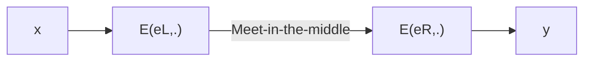

# 🔐 Foundations of Cybersecurity

The student will acquire knowledge about applied cryptography, secure coding, and web security. The objective of the course is to make a student able to properly design and implement a secure distributed application.

More precisely, the student will get a detailed knowledge of the main cryptographic primitives (ciphers, hash functions, digital signatures), their properties in terms of security and performance, and their appropriate usage in designing and building protocols and systems. The student will also get basic notions about secure coding, web security, and the related main attacks including buffer overflow and SQL injection.

# 📝 Exam Practice 
Course Foundations of Cybersecurity with Professor Dini

## 📚 Theory

### Exercise n.1

State and prove Shannon’s Theorem.

<details><summary>Solution</summary>
<p>

In a perfect cipher $\left | K \right | \geq \left | P \right |$; it means the number of keys cannot be smaller than the number of messages.

*Proof*. To prove it by contradiction try and assume that the statement is false, proceed from there, and at some point, you will arrive at a contradiction:
- Let's assume $\left | K \right | < \left | P \right |$
- For the invertibility, it is reasonable to have $\left | C \right | \geq \left | P \right |$; because if $\left | C \right | < \left | P \right |$ there are at least two plaintexts for a ciphertext, so we cannot derive the plaintext for a given ciphertext (not invertible).
- From the previous relations we have $\left | C \right | > \left | K \right |$. If we encrypt a plaintext $p_0 \epsilon P$ with all possible keys $k_i$, there is at least a ciphertext $c_0 \epsilon C$ that is not the preimage of $p_0$.
- Then, we have $P(P=p_0) \neq 0$ and $P(P = p_o | C = c_0) = 0$. We found a case in which the definition of Shannon is not verified, so we found a contradiction.

Perfect Secrecy means unconditional security, because we assume that an adversary has infinite computing resources and observation of the ciphertext provides the adversary with any information. A necessary condition for perfect secrecy is that the key bits are truly randomly chosen (we might be able to decrypt if is not perfectly random) and the key length is at least as long as the message length.

</p> 
</details>

### Exercise n.2

Explain the RSA key generation algorithm, discussing the complexity of each step.

<details><summary>Solution</summary>
<p>
The key generation algorithm. The RSA key generation algorithm is:
  
1. Choose two large distinct primes $p,q$
2. Compute the modulus $n = p \times q$
3. Compute the Euler's Phi function $\phi(n) = (p-1) \times (q-1). \phi(n)$ returns the number of integers in $\mathbb{Z}_n$ coprime with n.
4. Randomly select the public (encryption) exponent $e: 1 < e < \phi (n)$ , s.t $gcd(e, \phi(n) ) = 1$ (e is coprime with $\phi (n)$ ).
5. Compute the unique private (decryption) exponent $d: 1 < d < \phi$, s.t $e \cdot d \equiv 1 mod( \phi )$. This equivalence contains one unknown (d). We can compute d from the equation $e \cdot d \equiv 1 + t \phi $. For a certain value of t (it denotes a multiple of $\phi$, we are not interested in a particular value). We are able to solve this equation because e is coprime with $\phi (n)$ and the solution is $d = e^{-1} mod( \phi )$.
7. Private $key = (d,n)$
8. Public $key = (e,n)$

Primes p and q are $100 \div 200$ decimal digits, nowadays are around 1024 bit. Condition $gcd(e,\phi(n))=1$ guarantees that d exists and is unique. At the end of key generation, p and q must be deleted. If an adversary finds them it is able to compute d, e, and n. Two parts of the algorithm are not trivial; step 1, because is very demanding (large prime numbers), steps 4-5 (Step 5 are crucial for RSA correctness). 

</p>
</details>

### Exercise n.3

Describe the meet-in-the-middle attack on 2DES and argue about its complexity.



<details><summary>Solution</summary>
<p>
  
Two times encryption 2DES. We encrypt the plaintext twice, considering the case in which the algorithm is used twice: $y = 2E((e_L,e_R), x) = E(e_R, E(e_L,x))$, where x is a plaintext y is the ciphertext and $(e_L,e_R)$ are the left and the right key respectively. The key size is 2k bits (double), so a brute force attack requires $2^{2k}$ steps. 2E has performance penalties. It is two times slower than DES because it encrypts the message twice. It seems that we have significant security improvement, but this is not true. In fact, a meet-in-the-middle attack is possible.

A meet-in-the-middle attack is a known-plaintext attack, the adversary must know at least one plaintext/ciphertext pair. The attack is performed as follows:
- Build a table T containing $z=E(e_L, x)$ for all possible left-keys. Keep T sorted according to z.
- Check whether $z'=D(eR, y)$ is contained in the table T, for all possible right-keys. If z' is contained in T then $(e_L, e_R)$ maps x into y with $e_L$, s.t $T[e_L] = z'$ (Meet-in-the-middle)

Attack complexity:
* **Data Complexity**: Negligible. It needs at least a pair of data. There might be false positives. For simplicity, we assume the probability of false positives is negligible. anyway, to get rid of them we may need two or more plaintext/ciphertext pairs.
* **Storage Complexity**: Storage necessary for $T \approx O(2^k)$. The table has many entries as the number of keys, it grows exponentially with the size of the key.
* **Time Complexity**: Time complexity for 1 + time complexity for step 2 = time for building and sorting the table + time for searching in a sorted table = $k2^k + k2^2 \approx O(2^k)$

Double encryption is not more secure than single encryption. The time complexity is the same as the brute force attack of single encryption. The comparison is unfair because the meet-in-the-middle attack requires much storage, but it is still not better in terms of time complexity. 2DES has time complexity $(2^56)$ and space complexity $(2^56)$. It brings no advantages.

</p>
</details>


### Exercise n.4

With reference to SSL, describe the Handshake protocol in the case of server authentication.

<details><summary>Solution</summary>
<p>

SSL guarantee security at the transport layer (this is important for e-commerce). It is largely used today, for example in https, emails, and some application layer. SSL is a protocol suite composed of 4 protocols:

- Handleshake protocol (the most important one)
- Change cipher protocol
- Alert protocol
- Record protocol

**Server Authentication:** It is still a simplified version of the protocol in which only the server authenticates (asymmetric authentication). It is a widespread use case, typically, clients are authenticated at the application level. The server is authenticated, and a secure channel is established using this protocol; thus, the client may authenticate with a password.
The server hello done message is needed because SSL also allows performing client authentication. This message reports that round two is over. In round 3, the server requests and verifies the client certificate. If the client and the server choose another public key algorithm, for instance, Diffie-Hellman, the server sends a server key exchange message to send the public parameters.
The client and the server tell each other what they can do through the hello messages (for example, SSL version, cipher suite, compression method). The cipher suite is a list of algorithm tuples that are typically sorted in order of preference. A tuple specifies:
- The key establishment
- Cipher, Cipher type, IV size, isExportable
- MAC, hash size
- Key material

Some tuples are standard, example, SSL_RSA_WITH_3DES_EDE_CBC_SHA. Support key establishment schemes are:
- RSA (certified to avoid meet-in-the-middle). The server sends the certificate.
- Fixed Diffie-Hellman (certified: fixed public parameters p and g). The server's public parameters (p,g, Y) are certified by a Certification Authority (CA). The client's certificate is required if client  authentication is required.
- Ephemeral Diffie-Hellman (signed, dynamic public parameters). This protocol guarantees Perfect Forward Security. DH public keys are digitally signed (RSA or DSS). Signing keys are certified.
- Anonymous Diffie-Hellman (non authenticated). DH without authentication. It is vulnerable to a meet-in-the-middle attack.

The certificate from the server is always requested except for anonymous Diffie-Hellman. For each alternative, the content of messages may change; some message may be empty. The server_key_exchange message is not requested in fived Diffie-Hellman and RSA. The format of the message depends on the chosen key exchange algorithm. The server_key_exchange is requested in anonymous Diffie-Hellman, ephemeral Diffie-Hellman, and RSA. Similarly, the format of the client_key_exchange message depends on the chosen key establishment. 
  
</p>
</details>

### Exercise n.5

1. Illustrate the authenticated encryption (AE) scheme *encrypt and authenticate*.
2. Argue whether it can be considered secure.
3. Illustrate the AE scheme “encrypt then authenticate”.

<details><summary>Solution</summary>
<p>

Authenticated Encryption (AE) schemes provide both confidentiality and integrity by encrypting the plaintext message and generating an authentication tag that ensures the message's integrity. Here, I'll illustrate the general structure of an AE scheme and then specifically explain the "encrypt then authenticate" approach.

Authenticated Encryption Scheme (Encrypt and Authenticate):
Encryption: The scheme takes as input a plaintext message $M$ and a secret key $K$. It encrypts the message using a symmetric encryption algorithm, resulting in a ciphertext $C$.
Authentication: The scheme generates an authentication tag $T$ based on the ciphertext $C$ and the secret key $K$. The authentication tag is computed using a message authentication code (MAC) algorithm or a cryptographic hash function. It ensures the integrity and authenticity of the ciphertext.
Output: The scheme outputs the ciphertext $C$ and the authentication tag $T$.
The ciphertext $C$ and the authentication tag $T$ are typically sent together to the recipient. Upon receiving the ciphertext and the authentication tag, the recipient can verify the integrity of the ciphertext by recomputing the authentication tag using the received ciphertext and the shared secret key. If the computed authentication tag matches the received tag, the recipient can be confident that the ciphertext has not been tampered with.

Now, let's focus on the "encrypt then authenticate" approach, which is a specific design pattern within AE schemes:

AE Scheme: "Encrypt then Authenticate":
Encryption: The plaintext message $M$ is first encrypted using a symmetric encryption algorithm, resulting in a ciphertext $C$.
Authentication: The ciphertext $C$ is then authenticated using a MAC algorithm or a cryptographic hash function, generating an authentication tag $T$. The authentication process operates on the encrypted ciphertext, ensuring that any modification or tampering with the ciphertext will be detected.
Output: The scheme outputs the ciphertext $C$ and the authentication tag $T$.
In the "encrypt then authenticate" approach, the authentication process is applied to the encrypted ciphertext rather than the plaintext. This ensures that the integrity of the ciphertext is protected, and any unauthorized modification will be detected before decryption.

Security Considerations:
The AE scheme, when properly implemented and used correctly, can provide both confidentiality and integrity of the encrypted messages. However, the security of the scheme depends on the choice of encryption algorithm, MAC algorithm, and key management practices. It is essential to use strong and secure algorithms and ensure the secure exchange and storage of encryption keys and authentication keys. Additionally, proper handling of initialization vectors (IVs) and nonce values is crucial to prevent certain attacks.

Overall, AE schemes are widely used and considered secure when implemented correctly with appropriate cryptographic primitives and key management practices. It is essential to follow recommended best practices and stay updated with the latest advancements in cryptography to ensure the security of AE implementations.

</p>
</details>


### Exercise n.6

With reference to one-time pad (OTP), answer the following questions.

1. Illustrate the key generation, encryption, and decryption algorithm.
2. Given $k_{0} = 0^n$, then $c = p \oplus k_{0} = p^1$. Argue whether removing $k^0$ from the key set is a good idea or not.
3. Let c = "HELLO". Specify which of the following strings could constitute possible corresponding plaintexts and which cannot be.
    1. "HELLO"
    2. "LIGHT"
    3. "BLUE"
    4. "YELLOW"

<details><summary>Solution</summary>
<p>
One Time Pad:
  
1. The basic idea is to replace the random keystream with a pseudo-random keystream, it is not truly a random keystream but it is the result of an algorithm. The pseudo-random generator G is an efficient and deterministic function from the seed space to the keystream space:  
   - Key generation: $G$ { $0,1$ } $^s$ $\rightarrow$ { $0,1$ } $^n$ $n>>s$
   - Encryption: $y = G(k) \oplus x$
   - Decryption: $x = G(k) \oplus y$
2. Is not a good idea, because removing $k^0$ the resulting cipher is not perfect anymore. The number of keys gets smaller than the number of messages so violating the necessary condition of Shannon's Theorem. 
3. Strings "Hello" and "Light" are possible plaintext with the same probability. Strings "Blue" and "Yellow" cannot be possible plaintext because they are, respectively, shorter and longer than any possible plaintext. 
  
</p>
</details>

### Exercise n.7

1. Illustrate and discuss the minimum set of information items you expect to find in a certificate.
2. Explain the difference between an invalid and a revoked certificate.
3. For each of the following certificate templates, indicate whether it is secure or not. Motivate your answers.
  1. $\left \langle A, \Pi_A, L_A  \right \rangle _A$
  2. $\left \langle A, \Pi_A, L_A  \right \rangle _{CA}$
  3. $\left \langle A, \Pi_A, L_A  \right \rangle _B , \left \langle B, \Pi_B, L_B  \right \rangle _B$
  4. $\left \langle A, \Pi_A, L_A  \right \rangle _B , \left \langle B, \Pi_B, L_B , ca=yes \right \rangle _{CA}$

Where $S_P(X)$ denotes the digital signature of principal $P$ on statement $X; \left \langle X  \right \rangle _P$ denotes ${X, S_P(X)}; \Pi_P$ denotes principal $P$’s public key, $L_P$ denotes the validity interval of $\Pi_P$ and finally, $CA$ denotes a trusted certification authority.

<details><summary>Solution</summary>
<p>

1. The Diffie-Hellman Key Exchange protocol suffers from the meet-in-the-middle attack because the message for exchanging the keys is not authenticated (no link between the sender and the key). The solution is using certificates. 
The minimum information items are:
$Cert_A = A, pubK_A , L_A , S_{CA} (A||pubK_a ||L_A )$ 

*A* is the identifier (identifier can be anything, for example, an IP address), $pubK_A$ is the public key, $L_A$ is the validity interval of the certificates (a certificate is valid for a limited amount of time), and || is the concatenation operator. The certificate is digitally signed by a Certification Authority (CA). The Certification Authority (CA) is a trusted third party (TTP) that attests to the authenticity of a public key. CA’s signature indissolubly links the identifier and public key (and other parameters).
Now, the man-in-the-middle attack should forge the certification authority’s digital signature to put its key (substitute $pubK$, and sign again the message with the digital signature of the CA). If the digital signature is secure, the problem is hard (certificates prevent the man-in-the-middle attack. 

2. A certificate is expired if the validity period is terminated. A certificate must be revoked if the private key gets compromised before certificate expiration, or even if a company employee has changed role or been fired. Thus, it must not sign on behalf of the company anymore.
   - A certificate revocation must be: **Correct and Timely**
        - Correct: Revocation can be granted only to authorized parties, for example, the owner or the issuer.
        - Timely: Revocation must be disseminated to all interested parties. (The ones who use the certificate) as soon as possible. Nevertheless, we may not know who has the public key (It is public); moreover; the public key users may not be online. Hence, revocation is difficult.
    
3. Let's analyze each certificate template and determine whether it is secure or not:

$\left \langle A, \Pi_A, L_A \right \rangle_A$
This certificate template represents a certificate issued by principal A, where $\Pi_A$ is A's public key, and $L_A$ is the validity interval of A's public key. However, the certificate is self-signed, denoted by the subscript A. Self-signed certificates are generally not considered secure because they lack a trusted third party to verify the authenticity of the public key. Therefore, this certificate template is not secure.

$\left \langle A, \Pi_A, L_A \right \rangle_{CA}$
In this case, the certificate is issued by a trusted certification authority (CA), denoted by the subscript CA. The CA is responsible for verifying and signing the certificate, providing a level of trust. As long as the CA is trusted and properly operates, this certificate template can be considered secure. The CA's signature on the certificate ensures the authenticity and integrity of A's public key. Therefore, this certificate template is secure.

$\left \langle A, \Pi_A, L_A \right \rangle_B , \left \langle B, \Pi_B, L_B \right \rangle_B$
This template represents two certificates, one issued by principal B to principal A, and the other issued by principal B to itself. The subscript B indicates that principal B is the issuer of both certificates. This scenario represents a scenario where principal B acts as a certification authority. If principal B is a trusted and reliable certification authority, and it can be ensured that B's certificate to itself is secure, then this certificate template can be considered secure. However, without additional information about B's authority and its trustworthiness, we cannot definitively determine the security of this template.

$\left \langle A, \Pi_A, L_A \right \rangle_B , \left \langle B, \Pi_B, L_B, \text{ca=yes} \right \rangle_{CA}$
This certificate template represents two certificates: one issued by principal B to principal A, and the other issued by a trusted certification authority (CA) to principal B. The subscript B indicates that principal B is the issuer of A's certificate, while the subscript CA indicates that the trusted CA is the issuer of B's certificate. Since the certificate for principal B is issued by a trusted CA, it adds an additional layer of trust and assurance. As long as the CA is trusted and properly operates, and assuming the CA's certificate to B is secure, this certificate template can be considered secure.

It's important to note that the security of a certificate also depends on the security of the underlying cryptographic algorithms and protocols used for generating and verifying the certificates. The analysis provided above focuses on the structure and trust relationships depicted in the certificate templates themselves.
</p>
</details>

### Exercise n.8

With reference to the Diffie-Hellmann key establishment protocol
1. Describe the protocol;
2. Argue about the security of the protocol w.r.t. a passive adversary;
3. Argue about the security of the protocol w.r.t. an active adversary;
4. Discuss a possible solution to the MIM attack

````mermaid
sequenceDiagram
    Alice->>Oscar [meet-in-the-middle]: M1: A, g^a mod p
    Oscar [meet-in-the-middle]-->>Bob: M1': A, g^c mod p
    Bob-->>Oscar [meet-in-the-middle]: M2: B, g^b mod p
    Oscar [meet-in-the-middle]-->>Alice: M2': B, g^c mod p
````

<details><summary>Solution</summary>
<p>

1. Describe the protocol:
  - Alice chooses a random secret number $a$ (private key)
  - Bob chooses a random secret number $b$ (private key)
  - Alice sends Bob a message: $Y_A \equiv g^a mod p$ (public key, so it is sent in clear)
  - Bob sends Alice a message: $Y_B \equiv g^b mod p$ (public key, so it is sent in clear)
  - Alice computes $K_{AB} \equiv (Y_B)^a \equiv g^{ab} mod p$
  - Bob computes $K_{AB} \equiv (Y_A)^b \equiv g^{ab} mod p$

Bob and Alice compute the same quantity which is the shared key. The Diffie-Hellman is very elegant; it involves four exponentiation and two messages.

2. Security of the protocol with respect to a passive adversary: Assume that an adversary eavesdrop $p,g,$ $Y_A \equiv g^a mod p$ and $Y_B \equiv g^b mod p$ and wants to compute $K_{AB}$. The Diffie-Hellman problem is, given those quantities, compute $g^{ab} mod p$. This problem is as simple as the discrete logarithm problem $(DHP \leq_p DLP)$, so if DLP can be easily solved, then DHP can be easily solved. Unfortunately, there is no proof of the converse (if DLP is difficult, then DHP is difficult). At the moment, we do not see any way to compute $K_{AB}$ from $Y_A$ and $Y_B$ without first obtaining either a or b.

3. Security of the protocol with respect to an active adversary: It suffers from meet-in-the-middle attacks. The adversary can replace both $g^a$ and $g^b$ with $g^c$. Alice believes in sharing a key with Bob, whereas she shares it with an adversary. So does Bob. The problem is that M1' and M2' carry no proof that $g^c$ is Alice's/Bob's public key. Nothing in the message M1 indissolubly links the identifier Alice to the public key $g^a$. We have an authentication problem that can be solved with certificates.

4. Plain Diffie Hellman Key Exchange suffers from the meet-in-the-middle attack because the message for exchanging the keys is not authenticated (no link between the key). The solution is using certificates. A certificate is a data structure that cryptographically links the identifier of a subject to the subject public key.
   
</p>
</details>

### Exercise n.9 

1. Describe the key generation algorithm of the RSA encryption scheme.
2. Discuss the complexity of each algorithm step.

<details><summary>Solution</summary>
<p>

1. RSA Key generation algorithm:
     - Choose two primes numbers p,q
     - Compute the modulus $n = p \times q$
     - Calculate the Euler's Phi function $\phi (n) = (p-1) \times (q-1)$ . $\phi (n)$ returns the number of integers $\mathbb{Z}_n$ coprime with $n$.
     - Randomly select the public (encryption) exponent: $e: 1<e< \phi (n)$ s.t $gcd(e, \phi (n)) = 1$. $e$ is coprime with $\phi (n)$
     - Compute the unique private (decryption) exponent: $d: 1<d< \phi$ s.t $d \equiv 1 mod \phi$. This equivalence contains one unknown (d). We can compute d from the equation $e \cdot d = 1 + t \phi$ for a certain value t (it denotes a multiple of $\phi$, we are not interested in particular value). We are able to solve this equation becaue $e$ is coprime with $\phi (n)$ and the solution is $d = e^{-1} mod \phi$
     - Private key: (d,n)
     - Public key: (e,n)
  
2. Discuss the complexity of each algorithm step: Primes p and q are $100 \div 200$ decimal digits, nowadays are around 1024 bit. Condition $gcd(e, \phi (n)) = 1$ guarantees that d exists and is unique. At the end of key generation p and q must be deleted. If an adversary finds them, it will be able to compute e,d and n. Two parts of the algorithm are not-trivial; step 1, because it is very demanding (large prime numbers), steps 4-5 (Step 5 it is crucial for RSA correctness).
   
</p>
</details>

## 📊 Analysis

### Exercise n.1

The hash function H(·) suffers from collision attacks in $2^{41}$, exploiting the inner structure function and simply appending properly crafted blocks to the message. Besides this, the size of H(·), 128 bits, limits its maximum collision resistance to $2^{64}$.

Willing to strengthen the H(·), three proposals are made:
* a) H-A(m) is defined as SHA2-256(H(m))
* b) H-B(m) is defined as H(SHA2-256(m))
* c) H-C(m) is defined as AESk(H(m)), with a fixed key k
* d) H-D(m) is defined as SHA2-256(H(SHA2−256(m)))


Comment on the improvements to the collision resistance of the resulting hash function. 

<details><summary>Solution</summary>
<p>

Let's analyze each proposal and comment on the improvements to the collision resistance of the resulting hash function:

**a) H-A(m) is defined as SHA2-256(H(m)):**
In this proposal, the hash function H(m) is applied first, followed by SHA2-256. Since SHA2-256 is a widely-used and well-analyzed hash function, it is believed to have a strong collision resistance property. By applying SHA2-256 to the output of H(m), it adds an extra layer of security against collision attacks on the inner structure of H(·). This additional step strengthens the collision resistance of the resulting hash function.

**b) H-B(m) is defined as H(SHA2-256(m)):**
Here, the order of applying the hash functions is reversed compared to the proposal (a). SHA2-256 is applied to the message m first, and then the result is passed through the hash function H(·). Since the inner structure of H(·) was vulnerable to collision attacks, applying SHA2-256 to the message before using H(·) can provide some resistance against these attacks. However, the overall improvement in collision resistance may not be as strong as in proposal (a) because the vulnerable inner structure of H(·) is still present.

**c) H-C(m) is defined as AESk(H(m)), with a fixed key k:**
In this proposal, the output of H(m) is encrypted using the AES (Advanced Encryption Standard) algorithm with a fixed key k. AES is a symmetric encryption algorithm widely used and considered secure. By applying AES encryption to the output of H(m), introduces an additional layer of complexity and makes it harder for an attacker to find collisions. However, it's important to note that the collision resistance of this proposal relies on the security of AES and the secrecy of the fixed key k.

**d) H-D(m) is defined as SHA2-256(H(SHA2−256(m))):**
This proposal combines the ideas from both proposal (a) and proposal (b). The message m is first passed through SHA2-256, then H(·) is applied, and finally, the resulting hash is passed through SHA2-256 again. By applying SHA2-256 twice, it adds an additional layer of security against collision attacks on the inner structure of H(·). This approach is similar to the proposal (a) but with an extra step of applying SHA2-256 to the final hash. As a result, it further strengthens the collision resistance compared to the original H(·) hash function.

In summary, among the given proposals, (a) and (d) offer the most significant improvements to the collision resistance of the resulting hash function. Proposal (a) applies SHA2-256 to the output of H(m), while proposal (d) applies SHA2-256 twice to the final hash. Both of these approaches add extra layers of security and are likely to enhance collision resistance. Proposal (b) provides some improvement but may not be as strong as (a) and (d) due to the vulnerable inner structure of H(·). Proposal (c) relies on AES encryption, which can provide additional complexity but its collision resistance depends on the security of AES and the secrecy of the fixed key.

</p>
</details>

### Exercise n.2

Alice wishes to protect passwords from an attacker who manages to grab the password file and then perform an offline attack, possibly based on a rainbow table attack. For this reason, Alices decides to salt the hashing. Let p denote a plaintext password and s a 128-bit random salt. 

Alice adopts the following salting scheme: **Scheme 1:** Compute $h = MD5^{1000}(p) \oplus s$, and store the pair (h, s) in the password file.
* A. Discuss the security of this scheme w.r.t. a rainbow table attack.

Bob suggests Alice employ the following salting scheme: **Scheme 2:** Compute $h = MD5^{1000}(p || s)$, and store (h, s) in the password file.
* B. Is this choice better or worse than Alice’s w.r.t. a rainbow table attack?

Within Scheme 2, assume that users employ 8 characters chosen over the English lowercase alphanumeric characters.
* C. How many bits long should be the salt to prevent an attacker able to compute $2^{70}$ passwords from employing a rainbow table attack?
* D. Does the previous amount of random salt prevent an attacker from brute forcing a single password?

<details><summary>Solution</summary>
<p>

* **A. Security of Scheme 1 against Rainbow Table Attack:**

Scheme 1, which involves computing $h = MD5^{1000}(p) \oplus s$ and storing (h, s) in the password file, provides some level of protection against rainbow table attacks.

Rainbow table attacks rely on precomputed tables of hashed values for a large set of possible plaintext passwords. However, in Scheme 1, the salt (s) is combined with the result of multiple iterations of the MD5 hashing function applied to the plaintext password (p). This salted value (h) is then stored in the password file.

The use of salt introduces a unique and random component to each hashed password, making it infeasible to create a precomputed rainbow table that covers all possible salt values. Therefore, even if an attacker has access to the password file, they cannot easily retrieve the original passwords using a rainbow table.

However, it's important to note that MD5 is a relatively weak hashing algorithm, and performing only 1000 iterations of MD5 may not provide sufficient protection against modern attacks. Stronger and more secure hashing algorithms, such as SHA-256 or bcrypt, are recommended for better resistance against brute-force and dictionary attacks.

* **B. Security of Scheme 2 against Rainbow Table Attack:**
  
Scheme 2, which involves computing $h = MD5^{1000}(p || s)$ and storing (h, s) in the password file, is generally considered more secure against rainbow table attacks compared to Scheme 1.

In Scheme 2, the salt (s) is concatenated with the plaintext password (p) before applying the hashing function. This ensures that each password is hashed with a unique salt value. The resulting salted hash (h) is stored along with the salt in the password file.

By incorporating the salt directly into the hashing process, Scheme 2 further strengthens the resistance against rainbow table attacks. It prevents the use of precomputed rainbow tables because the salted hash values are specific to the individual password and salt combination.

* **C. Determining Salt Length to Prevent Rainbow Table Attack:**

To prevent an attacker from employing a rainbow table attack and computing $2^{70}$ passwords, the length of the salt should be sufficient to ensure a large enough salt space.

If we assume that the salt is randomly generated and each character can be chosen from the set of 26 lowercase English alphabets, 10 digits, and the underscore symbol (total 37 characters), we can calculate the required salt length as follows:

Total salt space = Number of possible characters ^ Salt length

- For $2^{70}$ possible passwords, we have:$2^{70} = 37^{\text{Salt length}}$
- Taking the logarithm base 37 on both sides: $70 = \log_{37}(2^{70}) = \text{Salt length}$

Therefore, the salt should be at least 70 characters long to prevent an attacker from computing $2^{70}$ passwords using a rainbow table attack.

* **D. Preventing Brute Force Attack with the Random Salt Length:**
  
The amount of random salt discussed in the previous answer (70 characters) would also effectively prevent an attacker from brute-forcing a single password. Brute-forcing involves trying all possible combinations until the correct password is found.

With a salt length of 70 characters, even with a powerful computational setup, it would be computationally infeasible for an attacker to iterate through all possible salt values in order to find the correct password. The large salt space makes it highly unlikely for an attacker to successfully brute force a single password within a reasonable amount of time.

It's important to note that the choice of a strong and slow hashing algorithm (such as bcrypt or Argon2) is also crucial to resist brute force attacks, as it significantly slows down the hashing process and increases the computational cost for the attacker.

</p>
</details>

### Exercise n.3

A client C and server S share a password P. Furthermore, C knows the public key $\prod_S$ of the server S. Client’s and server’s clocks are not synchronized. Design a protocol that makes it possible to establish a symmetric session key $k_{cs}$ between the client and the server. The protocol must avoid both the replay attack and the offline password-guessing attack. Furthermore, it must satisfy the key authentication and key confirmation properties.

<details><summary>Solution</summary>
<p>

1. **Initialization:**
* Client C generates a random nonce Nc and sends it to server S.
* Server S generates a random nonce Ns, computes the ciphertext Ciphertext_P = Encrypt(P, $\prod_S$), where Encrypt is the encryption function using the server's public key, and sends it to the client C.

2. **Client-Server Authentication:**
* Client C verifies the received ciphertext Ciphertext_P using its private key, Decrypt(Ciphertext_P, Private_Key_C), to obtain the password P.
* Client C computes the value Hash_P = Hash(P), where Hash is a secure hash function, and sends it to server S.
* Server S compares the received Hash_P with the stored hash value of the password it has.
  
3. **Server Authentication:**
* Server S generates a random nonce Ns', computes the ciphertext Ciphertext_Ns' = Encrypt(Ns', $\prod_C$), where Encrypt is the encryption function using the client's public key, and sends it to the client C.
* Client C verifies the received ciphertext Ciphertext_Ns' using its private key, Decrypt(Ciphertext_Ns', Private_Key_C), to obtain Ns'.
* Client C sends the concatenation of Nc, Ns, and Ns' to server S.

4. **Session Key Generation:**
* Server S computes the session key K = Hash(Nc || Ns || Ns') and sends it to the client C.
* Client C also computes the session key K' = Hash(Nc || Ns || Ns').

5. **Key Confirmation:**
* Client C sends the encrypted value Ciphertext_K = Encrypt(K, $\prod_S$) to server S.
* Server S decrypts the received ciphertext Ciphertext_K using its private key, Decrypt(Ciphertext_K, Private_Key_S), to obtain K.
* Server S compares the received K with its computed K'.
* If the comparison is successful, both client C and server S have confirmed the correctness of the session key.
  
</p>
</details>

### Exercise n.4

Let m be a 256-bit message and $m_i$ denote the i-th. Consider the following one-time digital signature scheme.
* Key generation algorithm.
  1. Generate two random sequences $S^0$ and $S^1$, both of 256 elements, defined as follows: $𝑆^𝑘 = {𝑆_{𝑖}^𝑘 , 1 ≤ 𝑖 ≤ 256}, 0 ≤ 𝑘 ≤ 1, s.t., 𝑆_{𝑖}^𝑘 ← random()|_{256}$. Let $S = {S^0, S^1}$ be the private key.
  2. Generate two sequences $P^0$ and $P^1$, defined as follows $𝑃^𝑘 = {𝑃_{𝑖}^𝑘 , 1 ≤ 𝑖 ≤ 256}, 0 ≤ 𝑘 ≤ 1, s.t., 𝑃𝑖𝑘 ← 𝐻(𝑆_{𝑖}^𝑘)$, where H() is a 256-bit one-way hash function. Let $P = {P^0, P^1}$ be the public key.

* Signature generation algorithm. The digital signature $D$ of $m$ is defined as follows:

$$
\forall 1 \leq  i \leq  256, D{i} = 
\begin{Bmatrix}
 S_{i}^0 & \text{if } m_{i} = 0 \\
 S_{i}^1 & \text{if } m_{i} = 1 
\end{Bmatrix}
$$

Answer the following questions.
1. Determine the size in a bit of the digital signature.
2. Specify the signature verification algorithm.
3. Argue about the unforgeability of the signature scheme.
4. Assume the secret key is used to digitally sign two different messages x and y. Let X and Y be their respective digital signatures. Describe a possible existential forgery attack that generates a valid pair (z, Z).

<details><summary>Solution</summary>
<p>

1. The size of the digital signature is determined by the number of bits required to represent each element in the signature. In this case, each element in the signature $D_i$ is chosen from $S^0$ or $S^1$, which are sequences of 256 elements each. Since each element can be represented using 256 bits (as defined in the key generation algorithm), the digital signature size is 256 * 256 = 65,536 bits.

2. The signature verification algorithm for this scheme is as follows:
* Given a message $m$, its digital signature $D$, and the public key $P$, perform the following steps for each bit $m_i$ and the corresponding element $D_i$ in the digital signature:
Compute $P_i$ as $H(S_i^{m_i})$ using the one-way hash function $H()$.
If $P_i$ matches $P_i^{m_i}$ from the public key, continue to the next bit.
If $P_i$ does not match $P_i^{m_i}$ for any $m_i$ and $D_i$, the signature verification fails, indicating that the signature is not valid.

3. The unforgeability of the signature scheme relies on the random selection of elements from the private key $S$ and the computational hardness of the one-way hash function $H()$. Since the private key $S$ is chosen randomly and independently for each bit of the message, it is computationally infeasible for an attacker to guess the correct signature elements $S_i^0$ and $S_i^1$ based on the observed signatures $D_i$. Additionally, the one-way hash function $H()$ makes it computationally infeasible to find a pre-image for a given hash value, ensuring that the public key $P$ cannot be used to derive the private key $S$ and forge valid signatures.

4. In this signature scheme, it is not possible to generate an existential forgery attack to produce a valid pair (z, Z) if the secret key is used to sign two different messages x and y. This is because the signature generation algorithm directly uses the secret key $S$ to determine the elements in the signature $D$, based on the bits of the message. Since the signature elements are completely determined by the secret key, it is not possible to generate a valid signature for any other message without knowing the secret key. Therefore, an attacker cannot forge a valid pair (z, Z) without knowledge of the secret key used for signing.

</p>
</details>

### Exercise n.5
Assume a threat model in which an adversary can steal the password file and perform an off-line Rainbow Table attack.
1. Assume we adopt the following salted hashing technique: $h = H^{1000}(p) \oplus s$ where $p$ is the plaintext password, $s$ is a 128-bit random salt, and $H$ is a secure one-way has function. The pair $(h, s)$ is stored in the password file on disk. Is this approach secure? Explain why.
2. Assume now we adopt the following salted hashing technique: $h = H(p||s)$ and again, we store the pair $(h, s)$ in the password file on disk. Is this choice better than the previous one? Explain why.
3. With reference to the second hashing scheme, if users employ 8 characters passwords chosen over the lowercase alphanumeric characters, how many bits long should be the salt to prevent an attacker able to (pre-)compute 270 passwords from employing a Rainbow Table attack?
4. Does the previous amount of random salt prevent an attacker from brute-forcing a single password?


<details><summary>Solution</summary>
<p>

1. The first approach of using the salted hashing technique $h = H^{1000}(p) \oplus s$ is not secure against an off-line Rainbow Table attack. The main issue is that the hashing is not computationally expensive enough to slow down the attacker significantly. While the salt adds some randomness to the hash, the repeated application of the one-way hash function $H$ for only 1000 iterations may still be susceptible to efficient precomputation using a Rainbow Table attack. A determined attacker could precompute a large number of hashes for common passwords and corresponding salts, making it easier to look up and reverse the hashed passwords.

2. The second approach of using the salted hashing technique $h = H(p||s)$ is a better choice than the previous one. Concatenating the password $p$ and salt $s$ together and then hashing them with a secure one-way hash function provides better security. In this scheme, each password is hashed using a unique salt, preventing attackers from efficiently precomputing hashes using Rainbow Tables. Even if the attacker has access to a precomputed table, the use of unique salts makes it impractical to reverse the hashed passwords.

3. If users employ 8-character passwords chosen from lowercase alphanumeric characters (26 lowercase letters + 10 digits), there are a total of 36 possible characters for each position. Since we have 8 positions in the password, the total number of possible passwords is 36^8 ≈ 2.8 x 10^12. To prevent an attacker from employing a Rainbow Table attack to precompute hashes for all possible passwords, the salt should be long enough to ensure that the attacker cannot precompute all possible combinations. In this case, the salt should be at least log2(2.8 x 10^12) ≈ 41.9 bits long to provide sufficient protection against Rainbow Table attacks.

4. The amount of random salt used does not directly prevent an attacker from brute-forcing a single password. Brute-forcing involves trying all possible passwords until the correct one is found. However, the use of a unique salt for each password complicates the attacker's task because they would need to compute the hash for each guessed password individually, instead of being able to use precomputed tables or techniques like Rainbow Tables. The random salt adds complexity and makes it computationally expensive for an attacker to crack individual passwords, even if they have the hashed passwords and corresponding salts.

</p>
</details>

### Exercise n.6

Let us consider the DES cipher in the CBC mode of operation. Assuming we encrypt a very large amount of data with the same key, it is possible that two different ciphertext blocks, say $c_i$ and $c_j$,
with $i \neq j$, are the same.

1. Does the fact that $c_i = c_j$ leak any information regarding the plaintext blocks $m_i$ and $m_j$?
2. Does replacing DES with 3DES avoid information leakage?
3. How can we mitigate this attack?


<details><summary>Solution</summary>
<p>

1. If two different ciphertext blocks $c_i$ and $c_j$ are the same, it does leak information regarding the plaintext blocks $m_i$ and $m_j$. Since the CBC (Cipher Block Chaining) mode of operation XORs the plaintext blocks with the previous ciphertext block before encryption, if $c_i = c_j$, it means that the XOR of the previous ciphertext blocks with $m_i$ and $m_j$ is the same. This implies that $m_i \oplus c_{i-1} = m_j \oplus c_{j-1}$, which reveals a relationship between the plaintext blocks.

2. Using 3DES (Triple Data Encryption Standard) instead of DES does not completely avoid the information leakage caused by two different ciphertext blocks being the same. Although 3DES provides a higher level of security due to its increased key size and complexity, it still operates in the same CBC mode. Therefore, if $c_i = c_j$ in 3DES-CBC, it can still leak information about the relationship between $m_i$ and $m_j$, albeit with a higher level of difficulty for an attacker to exploit.

3. To mitigate the attack where two different ciphertext blocks are the same, known as a "collision" or "same ciphertext attack," we can use a technique called "initialization vector (IV) uniqueness." The IV is an additional input to the encryption process, and it should be different for each message encrypted with the same key. By ensuring that each message has a unique IV, even if the plaintext blocks are the same, the resulting ciphertext blocks will be different. This prevents the leakage of information and makes it harder for an attacker to deduce relationships between the plaintext blocks. It is important to generate IVs randomly and ensure they are never reused with the same key.
  
</p>
</details>

### Exercise n.7

Assume that a file (possibly the whole volume) is stored in its encrypted form under AES-128-CBC. The file can be randomly accessed on a per-block basis.

1. Show that it is possible to apply a controlled modification to a given location of the plaintext file while operating on the encrypted version (malleability attack).
2. Argue the price the adversary must pay for this attack.
3. Assume that we insert a parity bit in each file block. Is this control able to mitigate or prevent the malleability attack?

<details><summary>Solution</summary>
<p>

1. AES-128-CBC is vulnerable to a malleability attack due to the nature of the CBC mode of operation. In CBC mode, each plaintext block is XORed with the previous ciphertext block before encryption. This XOR operation introduces a form of "error propagation" where changes in the ciphertext block affect the decryption of the next plaintext block.
To perform a controlled modification to a given location of the plaintext file while operating on the encrypted version, an attacker can follow these steps:

* Let's assume the attacker wants to modify a specific block, denoted as Block X, in the plaintext file.
* The attacker selects a ciphertext block, denoted as Ciphertext Y, that corresponds to the block following Block X in the encrypted file.
* The attacker modifies Ciphertext Y to produce a new ciphertext block, denoted as Ciphertext Y'.
* When the encrypted file is decrypted, the modified ciphertext Ciphertext Y' will affect the decryption of Block X, resulting in a controlled modification to the corresponding plaintext block.

4.The price the adversary must pay for the malleability attack in this case is that they need to have access to the encrypted file and the ability to modify the ciphertext blocks. This means they must be able to intercept the communication or have gained unauthorized access to the encrypted file. Additionally, the attacker needs to correctly determine the position and content of the ciphertext block to modify, as well as ensure that the modification produces the desired effect on the corresponding plaintext block.

3. Inserting a parity bit in each file block does not mitigate or prevent the malleability attack. The parity bit serves as a basic integrity check, allowing the detection of errors in data transmission or storage. However, it does not protect against intentional modifications to the ciphertext. In a malleability attack, the attacker modifies the ciphertext block itself, which can still be done regardless of the presence of a parity bit. The attacker can simply adjust the parity bit accordingly to maintain the integrity of the modified ciphertext block, ensuring that the change is not detected by the parity check. Therefore, while parity bits can be useful for detecting unintentional errors, they do not provide protection against malleability attacks.

</p>
</details>

### Exercise n.8 

Alice and Bob use the Diffie-Hellman protocol to establish a session key. Let $Y_A$ and $Y_B$ be their respective public parameters. In order to prevent a man-in-the-middle attack, Alice and Bob maintain a trusting relationship with a trusted third party named Trent, who acts as a certification authority. These trust relationships are realized through the keys $K_a$ and $K_b$, which Alice and Bob, respectively, share with the authority in advance.

Assuming that the clocks of Alice, Bob, and Trent are not synchronized, design a protocol for the certification of the public parameters that allows achieving the following beliefs: $A \mid \equiv  \mapsto B$ and $B \mid \equiv  \mapsto A$

<details><summary>Solution</summary>
<p>

1. **Initialization:**

* Alice and Bob have their own public-private key pairs: $(P_{A}, S_{A})$ for Alice and $(P_{B}, S_{B})$ for Bob.
* Alice and Bob share secret keys $K_a$ and $K_b$, respectively, with the trusted third party Trent.
* Trent acts as the certification authority and has a public-private key pair: $(P_T, S_T)$.

2. **Certification Protocol:**

a. Alice to Trent:
* Alice generates her Diffie-Hellman public parameter $Y_A$.
* Alice creates a message to be certified: $M_{A} = (P_A, Y_A)$.
* Alice signs the message using her private key: $Sig_{A} = Sign(M_A, S_A)$.
* Alice sends the message and the corresponding signature to Trent: $(M_A, Sig_A)$.

b. Trent to Bob:
* Trent verifies the signature using Alice's public key $P_A$: $Verify(M_A, Sig_A, P_A)$.
* If the verification fails, Trent rejects the certification.
* If the verification is successful, Trent continues with the certification.
* Trent generates his Diffie-Hellman public parameter $Y_T$.
* Trent creates a message to be certified: $M_{T} = (P_T, Y_T)$.
* Trent signs the message using his private key: $Sig_{T} = Sign(M_T, S_T)$.
* Trent sends the message and the corresponding signature to Bob: $(M_T, Sig_T)$.

c. Bob to Trent:
* Bob verifies the signature using Trent's public key $P_T$: $Verify(M_T, Sig_T, P_T)$.
* If the verification fails, Bob rejects the certification.
* If the verification is successful, Bob trusts the public parameters $Y_A$ and $Y_T$.
* Bob generates his Diffie-Hellman public parameter $Y_B$.
* Bob creates a message to be certified: $M_{B} = (P_B, Y_B)$.
* Bob signs the message using his private key: $Sig_{B} = Sign(M_B, S_B)$.
* Bob sends the message and the corresponding signature to Trent: $(M_B, Sig_B)$.

d. Trent to Alice:
* Trent verifies the signature using Bob's public key $P_B$: $Verify(M_B, Sig_B, P_B)$.
* If the verification fails, Trent rejects the certification.
* If the verification is successful, Trent trusts the public parameters $Y_B$ and completes the certification.
* Trent sends a confirmation to Alice that Bob's public parameters have been certified.
* Key Exchange:

After the certification of public parameters, Alice and Bob can proceed with the Diffie-Hellman key exchange using their respective public parameters $Y_A$ and $Y_B$. They can calculate the shared session key using the Diffie-Hellman algorithm. By following this protocol, Alice and Bob can establish a trusting relationship with the certification authority Trent and achieve the desired beliefs: $A \mid \equiv \mapsto B$ and $B \mid \equiv \mapsto A$.
  
</p>
</details>

## 💻 Secure Coding

### Exercise n.1

Find and explain the vulnerabilities of the following function. Then patch them.
````c++
void ExpandVector(std::vector<int>& c) {
  // This code wants to expand the vector c by doubling each of its
  // elements. For example, the vector [1,2,3] must become
  // [1,1,2,2,3,3].
  auto i = c.begin();
  while (i != c.end()) {
    c.insert(i, *i);
    i++;
  }
}
````

<details><summary>Solution</summary>
<p>

The given function, ExpandVector, intends to double each element in a vector by inserting a copy of each element before the original element. However, it suffers from two vulnerabilities: an infinite loop and an iterator invalidation issue. Let's discuss these vulnerabilities and propose patches for each:

**Infinite Loop:**
The function uses an iterator, 'i,' to traverse the vector and double each element. However, it fails to update the iterator 'i' after inserting the copy of the element. As a result, the iterator remains pointing to the original element, causing an infinite loop where the same element is repeatedly inserted before itself.
Patch for the Infinite Loop vulnerability:
To fix this issue, the iterator 'i' should be updated to point to the next position after inserting the copy of the element. This can be achieved by using the return value of the insert function, which provides an iterator pointing to the newly inserted element. Here's the modified code:

````c++
void ExpandVector(std::vector<int>& c) {
  auto i = c.begin();
  while (i != c.end()) {
    i = c.insert(i, *i);
    i += 2;
  }
}
````

By incrementing **i** by 2 after inserting the copy of the element, we ensure that the iterator moves to the correct position for the next iteration.

**Iterator Invalidation:**
The insert operation in the original code may invalidate the iterator 'i,' leading to undefined behavior. When an element is inserted before the current position, all existing iterators may become invalid. In our case, the iterator 'i' can be invalidated after each insert operation.
Patch for the Iterator Invalidation vulnerability:
To handle iterator invalidation, we can modify the code to use the result of the insert operation as the new iterator for the next iteration. This ensures that the iterator remains valid throughout the loop. Here's the modified code:

````c++
void ExpandVector(std::vector<int>& c) {
  auto i = c.begin();
  while (i != c.end()) {
    i = c.insert(i, *i);
    std::advance(i, 2);
  }
}
````
By using **std::advance(i, 2)** instead of **i += 2**, we guarantee that **i** moves to the correct position while handling any potential iterator invalidation caused by the insert operation.
With these patches, the ExpandVector function should now correctly expand the vector by doubling each of its elements without suffering from an infinite loop or iterator invalidation issues.

  
</p>
</details>

### Exercise n.2

Find and explain the vulnerabilities of the following function. Then patch them.

````c++
void do_stuff(int aux) {
  if (aux<0) {
  /*Handle error*/}
  unsigned char* buf = (char*) malloc(aux);
  if (gets(buf) == NULL) {
    /* Handle error */}
    /* do other stuff */
}
````

<details><summary>Solution</summary>
<p>
  
</p>
</details>


### Exercise n.3

Find and explain the vulnerabilities of function EditStudent, then patch them.

````c++
struct student{
  int StudentID;
  char FirstName[100];
  char LastName[100];
  int DegreeID;
}
void EditStudent(student* stu, int Sid, int Did, char* Fname, char* Lname) {
  //The function replaces the value in the field of the structure pointed to by
  // stu with the values Sid, Did, Fname, Lname
  stu->StudentID = Sid;
  strcpy(stu->FirstName, Fname);
  strcpy(stu->LastName, Lname);
  stu->DegreeID = Did;
}
````

<details><summary>Solution</summary>
<p>

### Exercise n.4

Find and explain the vulnerabilities of the following function. Then patch them.

````c++
void ExpandVector(std::vector<int>& c) {
  //This code expands vector c by doubling each element.
  //For example, vector [1,2,3] becomes [1,1,2,2,3,3].
  for(auto i = c.begin(); i != c.end(); i++) {
    c.insert(i, *i);
  }
}
````

<details><summary>Solution</summary>
<p>
  
</p>
</details>
  
</p>
</details>


### Exercise n.5

A client of yours ask you to perform a black-box penetration test to the login page of his e-commerce website. Such a page displays a form with two fields, a *Username* field, and a *Password* field. The client provides you the following credentials: *Engineer* as username and *Computer* as password. You make an attempt to login by specifying *Engineer’ -- * as username, and a password of your invention. The login fails. Is this test sufficient to conclude that the website is safe against SQL injection attack?

<details><summary>Solution</summary>
<p>
  
</p>
</details>

### Exercise n.6

Find, explain, and patch the vulnerabilities. If any, of the following function. The function expects a user to open a file in the /home/Alice/ path, from where it is executed.

````c++
void do_stuff(const char* file) {
  if (strlen(file) > 0 && file[0] == '/'){
      /* Absolute path! Handle error */
  }
  FILE *f = fopen(file, "r");
  if (!f) {
    /* File doesn’t exist, handle error */ }
  else {
    /* read file*/
  }
  fclose(f);
}
````

<details><summary>Solution</summary>
<p>
  
</p>
</details>

### Exercise n.7 

Find, explain, and patch vulnerabilities, if any, of the following functions:

````c++
unsigned int do_stuff(unsigned int a, unsigned int b){
  if(a+b>UINT_MAX)
    return 0;
  return a+b;
}
````
### Exercise n.8 

<details><summary>Solution</summary>
<p>
  
</p>
</details>


